# 08 - Implementar Azure Functions

## Rafael Román Martínez

### Enero 2023

En este tutorial, crearemos una aplicación de funciones para mostrar un mensaje de saludo cuando haya una solicitud HTTP.

# Tarea 1: Crear una aplicación Functions 

En esta tarea, crearemos un aplicación de funciones.

1. Inicie sesión en [Azure Portal](https://portal.azure.com/).
2. En el cuadro de texto **Buscar recursos, servicios y documentos**, en la parte superior del portal, busque y seleccione **Aplicación de funciones** y luego, desde la hoja **Aplicación de funciones**, haga clic en **Agregar**.

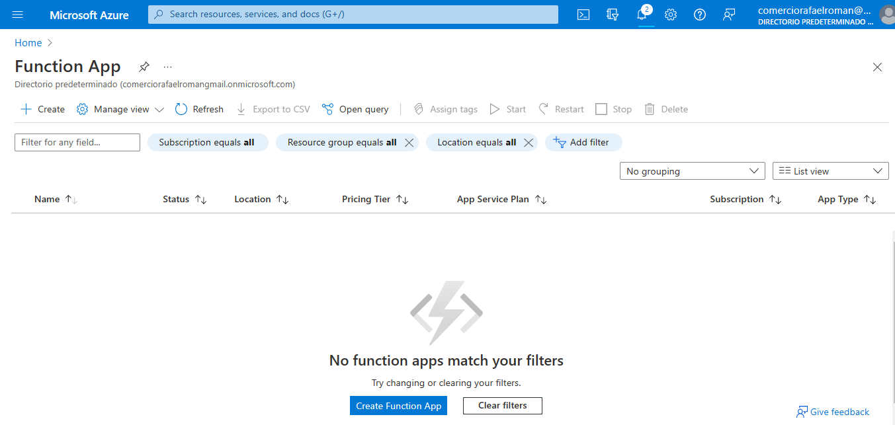

3. En la pestaña **Básico** de la hoja **Aplicación de funciones**, especifique la siguiente configuración (reemplace **xxxx** en el nombre de la función por letras y dígitos, de modo que el nombre sea globalmente único, y deje todas las demás configuraciones con sus valores predeterminados):

| Configuración                        | Valor                                                    |
| ------------------------------------ | -------------------------------------------------------- |
| Suscripción                          | el nombre de su suscripción de Azure                     |
| Grupo de recursos                    | el nombre de un nuevo grupo de recursos **myRGFunction** |
| Nombre de la aplicación de funciones | **función-xxxx**                                         |
| Publicar                             | **Código**                                               |
| Pila de tiempo de ejecución          | **NET Core**                                             |
| Versión                              | **3.1**                                                  |
| Región                               | **Este de EE. UU.**                                      |

**Nota** - Recuerde cambiar **xxxx** de modo que sea un **nombre de aplicación de Functions** único

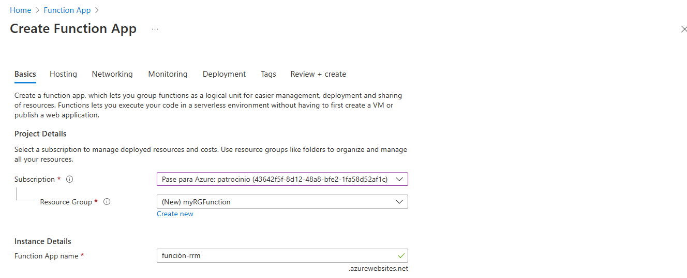

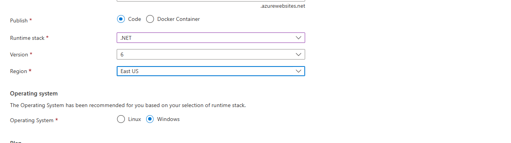

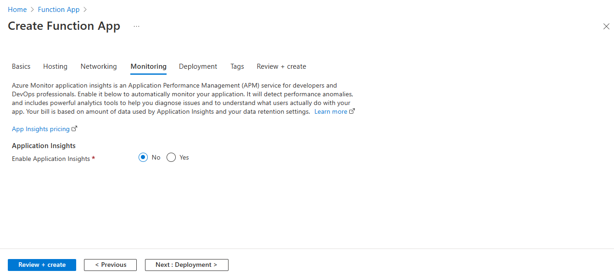

4. Haga clic en **Revisar y crear** y, después de una correcta validación, haga clic en **Crear** para empezar a aprovisionar e implementar su nueva aplicación de funciones de Azure.

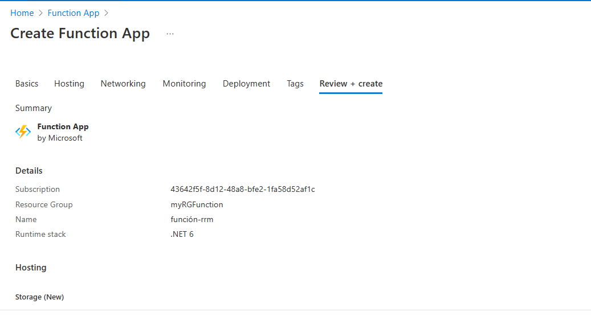

5. Espere la notificación de que el recurso ha sido creado.

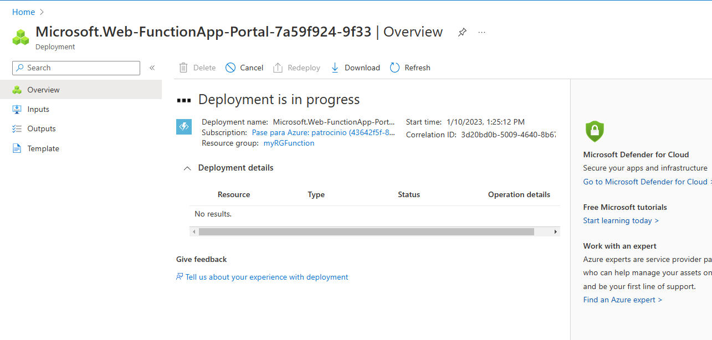

6. Vuelva a la hoja de **Aplicación de funciones**, haga clic en **Actualizar** y compruebe que la aplicación de función recién creada tenga el estado **Ejecutando**.

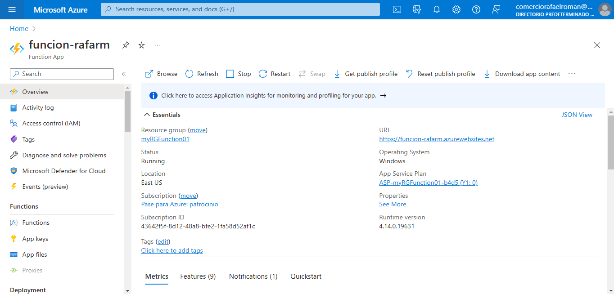

# Tarea 2: Crear una función activada por HTTP y probar

En esta tarea, usaremos la función API de Webhook para mostrar un mensaje cuando haya una solicitud HTTP.

1. Sobre la hoja **Aplicación de funciones**, haga clic en la aplicación de funciones recién creada.

2. En la hoja de la aplicación de funciones, en la sección **Funciones**, haga clic en **Funciones** y luego en **+ Agregar**.

   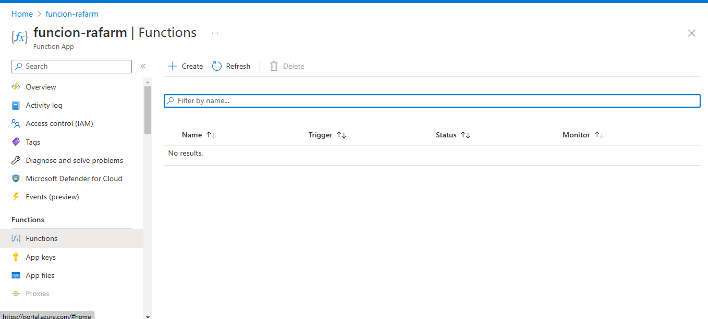

3. En la pestaña **Plantillas** de la hoja **Nueva función**, haga clic en **Desencadenador HTTP**.

   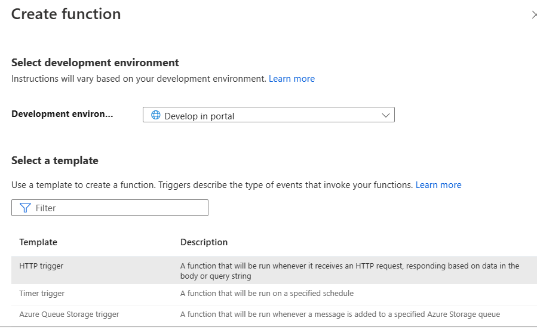

4. En la pestaña **Detalles** de la hoja **Nueva función**, acepte el nombre predeterminado **Nueva función** y el **Nivel de autorización** y luego haga clic en **Crear función**.

   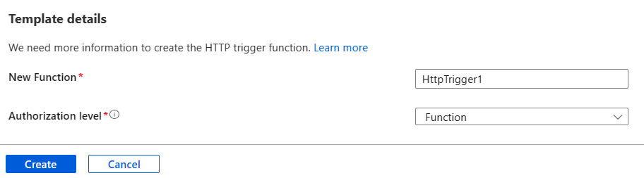

5. En la hoja **HttpTrigger1**, en la sección **Desarrollador**, haga clic en **Código + Prueba**.

   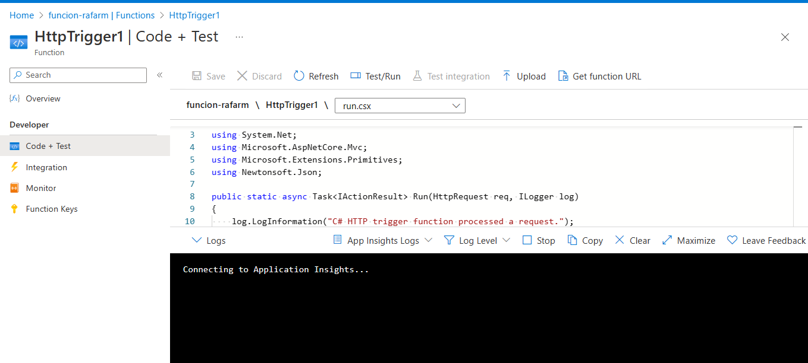

6. En la hoja **HttpTrigger1 |** En la hoja **Código + prueba**, revise el código generado automáticamente y tenga en cuenta que el código está diseñado para ejecutar una solicitud HTTP y registrar información. Además, observe que la función devuelve un mensaje de saludo con un nombre.

   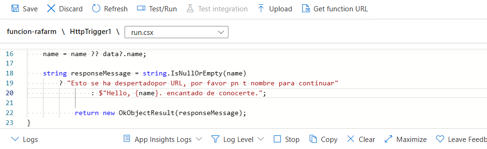

7. Haga clic en **Obtener URL de función** desde la sección superior del editor de funciones.

8. Asegúrese de que el valor en la lista desplegable **Clave** se establece en **predeterminado** y haga clic en **Copiar** para copiar la función URL.

   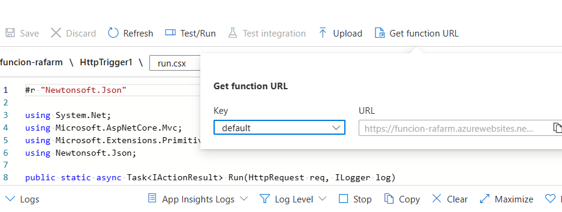

9. Abra una nueva pestaña del explorador y pegue la URL de la función copiada en la barra de direcciones del explorador web. Cuando se solicite la página, la función se ejecutará. Observe el mensaje devuelto que indica que la función requiere un nombre en el cuerpo de la solicitud.

   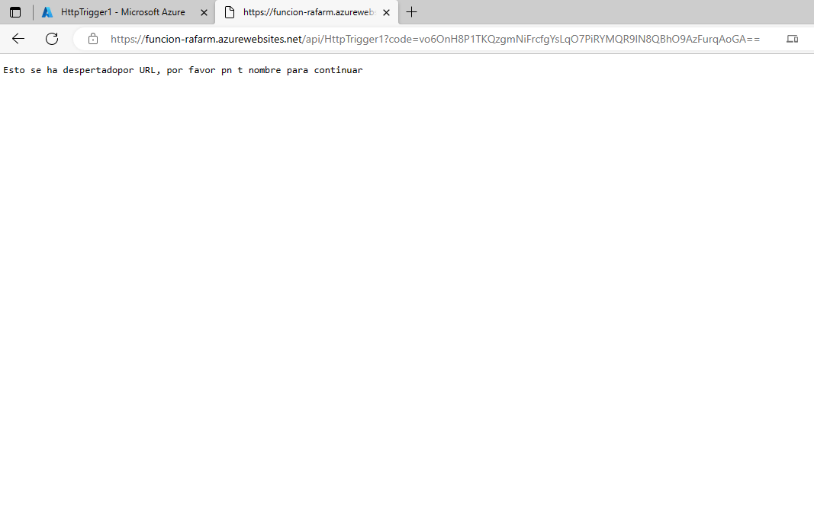

10. Agregue **&name=\*Agustina\*** al final de la URL.

    **Nota**: Reemplace ***yourname*** con su nombre. Por ejemplo, si su nombre es Cindy, la URL final se parecerá a la siguiente `https://azfuncxxx.azurewebsites.net/api/HttpTrigger1?code=X9xx9999xXXXXX9x9xxxXX==&name=cindy`

    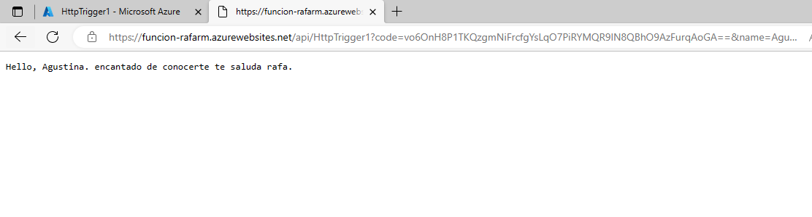

11. Cuando se ejecuta su función, se rastrea cada invocación. Para ver el seguimiento en Azure Portal, vuelva a **HttpTrigger1 |** Hoja **Código + Prueba** y haga clic en **Supervisar**.

    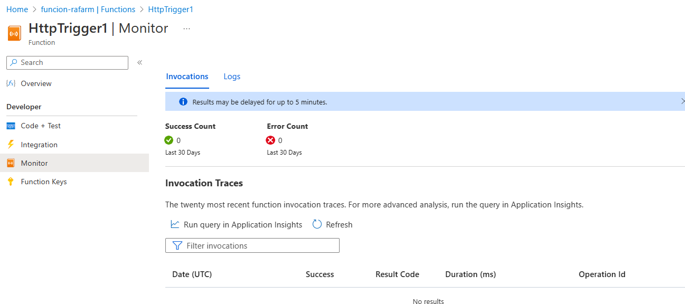

¡Enhorabuena! Ha creado una aplicación de funciones para mostrar un mensaje de saludo cuando hay una solicitud HTTP.

